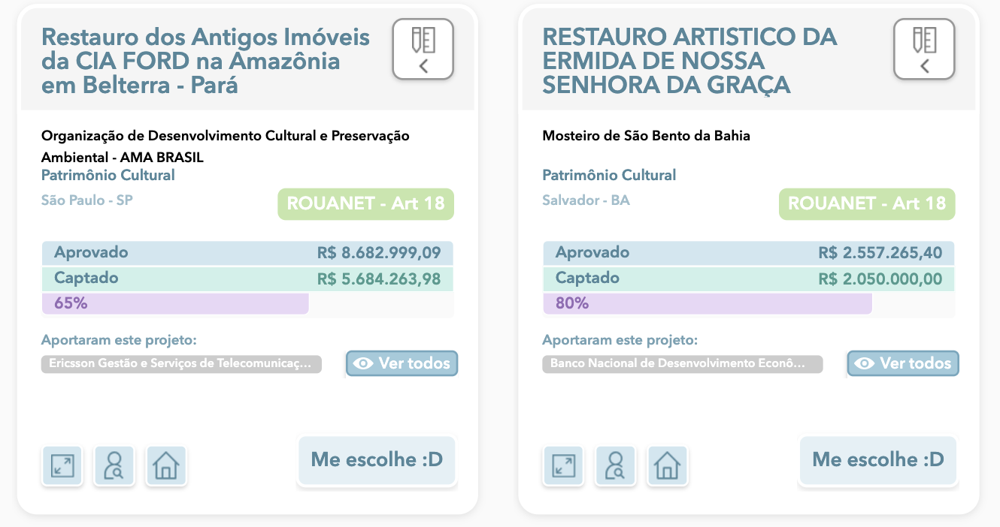
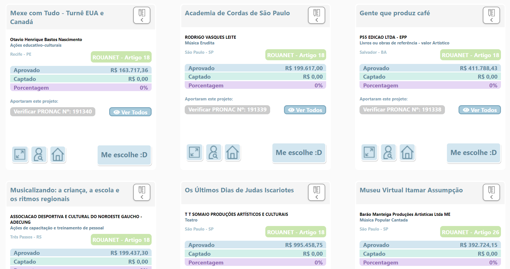

# Projetos Culturais

## Desafio:

Desenvolver uma página usando react + css ou sass + html, onde você irá consumir uma determinada API e exibir as informações na tela conforme a imagem abaixo:

 

O link para para a API:  http://api.salic.cultura.gov.br/doc/ 

Usar o método projetos.

## Resultado:

- npm install
 
 
